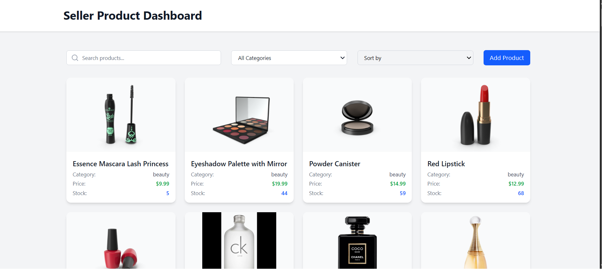
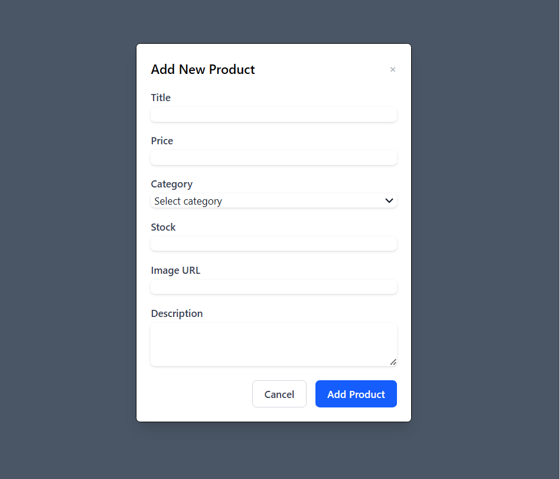
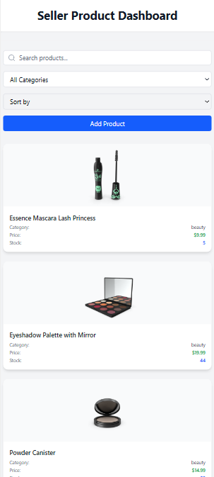

# Seller Dashboard

A web-based dashboard application that allows sellers to manage their products efficiently. This app enables sellers to add new products, search, filter by categories, sort products, and view the product details in an organized table with pagination.

## Features

- **Add New Product**: Easily add new products via a form modal.
- **Search Products**: Quickly search products by their title.
- **Filter by Category**: Filter products based on their categories.
- **Sort Products**: Sort products by title or other criteria (e.g., price).
- **Pagination**: Paginated view for managing large lists of products.
- **Stock Warning**: Products with stock less than 10 are highlighted in red to signal low inventory.

## Technologies Used

- **React**: A JavaScript library for building user interfaces.
- **Tailwind CSS**: A utility-first CSS framework for custom styling.
- **TypeScript**: For type safety and better development experience.
- **React Hooks**: Using `useState`, `useEffect` for state management and side effects.
- **Custom Components**: Organized components for modular design (e.g., `ProductTable`, `ProductFormModal`, `SearchBar`, `CategoryFilter`).

## Deployment

**Live Demo**: [View Deployed Application](https://seller-product-dashboard.vercel.app/)  

### Deployment Screenshots

| Page | Screenshot | Description |
|------|------------|-------------|
| 1    |  | Dashboard Overview up  |
| 2    |  |  Add product |
| 3    |  | Smart Phone screan view |
 
---
## Installation

### Prerequisites

- Node.js and npm installed. If you don't have them installed, please follow the official Node.js guide to install them:
  - [Install Node.js](https://nodejs.org/)

### Steps to Set Up

1. **Clone the repository**:

   ```bash
   git clone <https://github.com/Manishkumar82077/Product-Management-Dashboard>
   ```
2. **Navigate to the project folder**:
 ```
    cd seller-dashboard
 ```

3. **Install dependencies:**:
 ```
    npm install
 ```

4. **Start the development server:**:
```
    npm start
```


## Usage

- **Search**: Filter products by title using the search bar.  
- **Category Filter**: Select a category from the dropdown.  
- **Sort Options**: Sort products by title/price.  
- **Add Product**: Click "Add New Product" to open the form.  
- **Low Stock Alert**: Stock < 10 is highlighted in red.  
